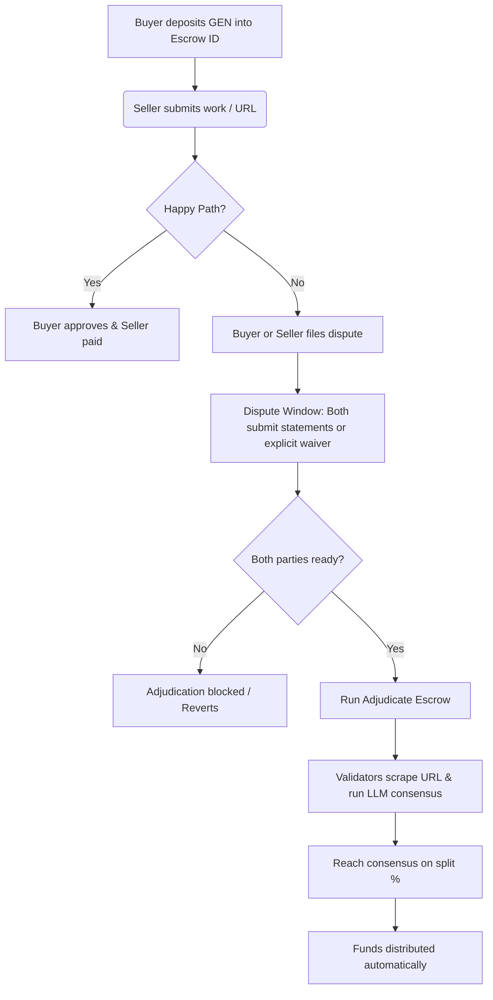

# ArbitratedEscrow - Intelligent Contract Primitive & Web3 DApp

An educational, reusable, and robust GenLayer Intelligent Contract primitive and Web3 DApp implementing a **Decentralized Escrow Registry with AI-Validator Arbitration**.

Traditional blockchain escrow contracts are structurally limited because they can only resolve disputes deterministically (e.g., via a simple API check or a trusted third-party oracle multisig). This primitive showcases how GenLayer allows contracts to resolve subjective, real-world agreements (like freelance contracts, code reviews, or trade disputes) autonomously using decentralized AI-validator consensus.

---

## 🌟 Key Features & Updates

- 🖥️ **Full Web3 DApp Frontend (`/frontend` and live root)**: Modern, responsive dashboard built with TailwindCSS and the official `genlayer-js` SDK, communicating directly with Bradbury Testnet JSON-RPC (`https://rpc-bradbury.genlayer.com`) and target contract (`0x27765327341E605F84493563A03Bf33d71ae0928`).
- 🔢 **Dynamic Identifier Capture**: The frontend dynamically captures the exact identifier produced by `create_escrow` on-chain and routes all subsequent funding (`deposit`), inspection (`get_escrow`), and arbitration (`adjudicate_escrow`) calls to that specific dynamic ID (no hardcoded index assumptions).
- 🛡️ **Race-Condition-Protected Dispute Engine**: Enforces strict bilateral statement requirements or explicit waivers (`waive_dispute_statement`), preventing front-running of AI arbitration.
- 📜 **Reproducible Multi-Escrow Verification Scripts (`/scripts`)**:
  - `scripts/test_multiple_escrows.js`: Reproducible script creating multiple sequential escrows, dynamically capturing identifiers, funding Escrow #1, and querying its independent state.
  - `scripts/interact.js`: Programmatic client interaction script.
- 🧪 **Comprehensive Pytest Suite (`/tests`)**: 6 unit tests validating multi-escrow sequential creation/funding, race-condition prevention, explicit waivers, and unauthorized caller reverts.

---

## 💡 How It Works & Use of Consensus

The contract uses GenLayer's **Equivalence Principle** and Large Language Models (LLMs) to arbitrate disputes.



### 1. The Escrow State Machine
An escrow goes through the following statuses:
*   `AWAITING_DEPOSIT`: Buyer creates the escrow with the agreement text and seller address.
*   `ESCROWED`: Buyer calls `deposit(escrow_id)` and locks native `GEN` tokens in the contract.
*   `DELIVERED`: Seller calls `submit_delivery(escrow_id, artifact)` and submits a text description or a web URL pointing to their work.
*   `DISPUTED`: If there is a dispute, either party calls `dispute_escrow(escrow_id, statement)` to lock funds and submit their claim.
*   `RESOLVED` / `REFUNDED`: The final state after manual approval, voluntary refund, or automated AI arbitration.

### 2. Dispute-Response Race Condition Prevention
To prevent front-running and unfair one-sided judgments, the contract guarantees that adjudication **cannot run** until both parties have had full opportunity to participate:
*   When a party files a dispute with `dispute_escrow(id, statement)`, the counterparty's right to respond is protected.
*   `adjudicate_escrow(id)` strictly enforces that **both parties must have either submitted their statement OR explicitly called `waive_dispute_statement(id)`**.
*   Attempting to call `adjudicate_escrow` prematurely reverts with `gl.vm.UserError`.

### 3. AI Consensus Adjudication Logic
When `adjudicate_escrow(escrow_id)` is triggered (after bilateral responses or explicit waiver):
1.  **Web Scraping (Non-Deterministic):** If the seller's delivery artifact is a URL, the validator node fetches the live content using `gl.nondet.web.render(url, mode="text")`.
2.  **LLM Inference (Non-Deterministic):** An LLM prompt is executed:
    *   It reviews the original **Contract Agreement**, the **Delivery Artifact** (and its fetched web page content), the **Buyer's Dispute Statement** (or explicit waiver notice), and the **Seller's Dispute Statement** (or explicit waiver notice).
    *   It determines who is in the right and allocates a payout percentage (from `0%` to `100%`) to the seller, returning the remaining funds to the buyer.
3.  **The Equivalence Principle (`gl.eq_principle.strict_eq`):** A leader validator proposes the allocation and reasoning. Other validator nodes verify the proposal against the criteria (fairness, logical reasoning, and proper JSON format). Once consensus is reached, the result is written back to the chain.
4.  **Payout Distribution:** The contract automatically splits the escrow balance and transfers `X%` to the seller and `(100 - X)%` to the buyer.

---

## 🧪 Local Testing Guide

Unit tests are written using the `genlayer-test` Direct Mode in-memory VM framework, allowing tests to run in milliseconds without launching a full simulator or Docker container.

### Running Pytest Suite
```bash
pytest tests/
```
All 6 tests (including multi-escrow sequential creation and independent funding) run and pass:
* `test_escrow_happy_path`
* `test_multiple_escrows_creation_and_funding`
* `test_escrow_voluntary_refund`
* `test_dispute_race_condition_prevented_and_resolved`
* `test_dispute_explicit_waiver_path`
* `test_escrow_reverts`

### Running Reproducible Node.js Multi-Escrow Script
```bash
node scripts/test_multiple_escrows.js
```

---

## 🔗 Live Deployment Info
*   **Bradbury Testnet Contract:** `0x27765327341E605F84493563A03Bf33d71ae0928`
*   **Explorer URL:** [https://explorer-bradbury.genlayer.com/address/0x27765327341E605F84493563A03Bf33d71ae0928](https://explorer-bradbury.genlayer.com/address/0x27765327341E605F84493563A03Bf33d71ae0928)
*   **Live DApp Website:** [https://earnadvise.github.io/genlayer-escrow-dapp](https://earnadvise.github.io/genlayer-escrow-dapp)
