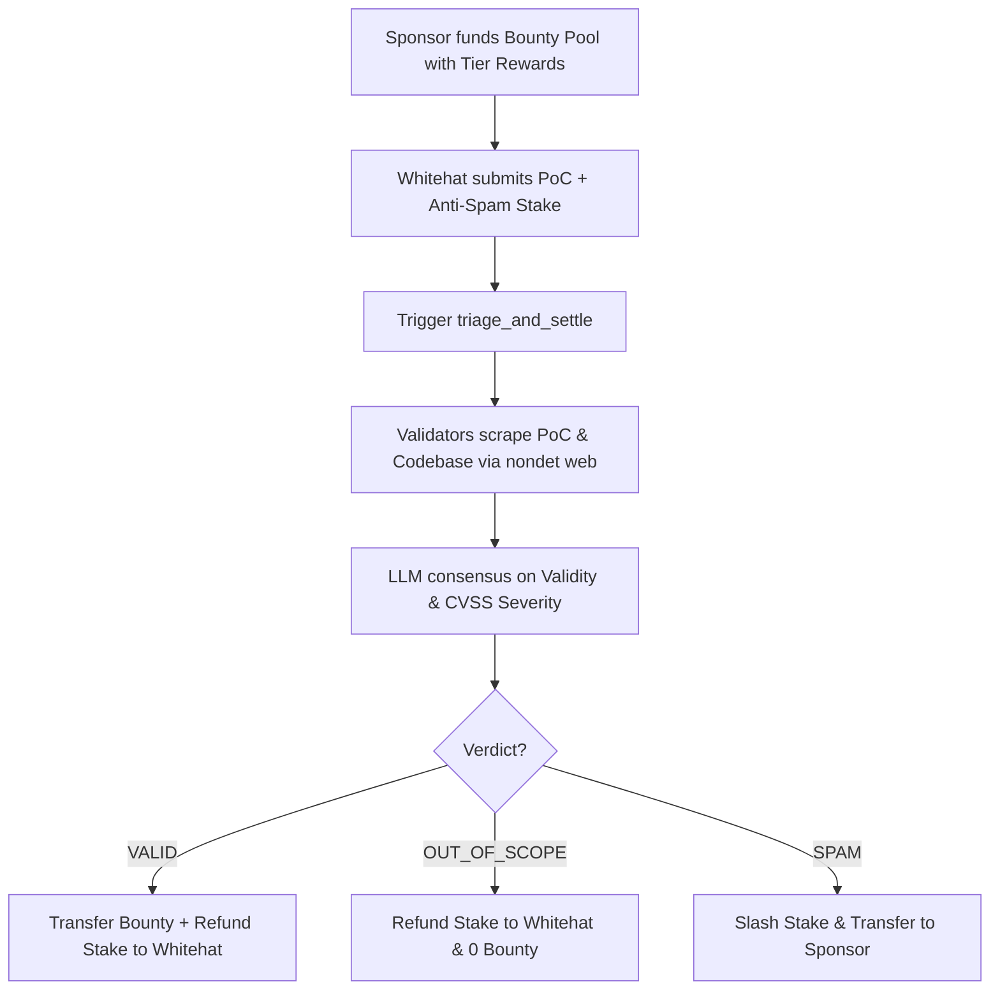

# GenLayer Intelligent Contract Primitives & Protocol Suite

A comprehensive repository of production-grade, educational, and reusable GenLayer Intelligent Contract primitives demonstrating real decentralized AI-validator consensus, non-deterministic web verification, and autonomous on-chain settlement.

---

## 📦 Intelligent Contract Primitives in this Repository

### 1. `AutonomousBountyOracle.py` — Decentralized Bug Bounty Triage & Settlement Primitive 🛡️
A decentralized bug bounty and vulnerability verification primitive for Web3 protocols and DAOs. Eliminates centralized triage bottlenecks (e.g. Immunefi/HackerOne delays or subjective dismissal) by utilizing multi-validator LLM consensus to verify exploit proof-of-concepts, calculate CVSS severities, and execute automated payouts.

- **Non-Deterministic Web Inspection (`gl.nondet.web.render`)**: Validators fetch the reported vulnerability advisory / GitHub PoC URL and verify live exploitability against the project's in-scope codebase.
- **Equivalence Principle Consensus (`gl.eq_principle.strict_eq`)**: Independent validator LLMs evaluate the bug report against the smart contract scope, assess severity (Critical, High, Medium, Low), and reach strict consensus on the verdict.
- **Anti-Spam Staking & Slashing**: Researchers deposit an anti-spam stake. Valid findings receive full stake refund + bounty reward. Out-of-scope reports receive stake refund with zero bounty. Malicious/spam submissions have their stake slashed and transferred to the pool sponsor.
- **Multi-Tranche Funding & Settlement**: Sponsors fund bounty pools with customized reward tiers. Funds are autonomously transferred directly to the whitehat's wallet upon consensus.

---

### 2. `ArbitratedEscrow.py` & `MilestoneEscrow.py` — Autonomous Milestone Escrow with AI Arbitration ⚖️
A decentralized commerce and freelance escrow primitive that arbitrates subjective deliverable disputes through multi-validator consensus.

- **Phased Tranche Releases**: Supports multi-milestone deliverables with independent funding, reviews, and payouts.
- **Race-Condition & Front-Running Prevention**: Enforces bilateral statements or explicit waivers (`waive_milestone_dispute`) before adjudication can be triggered.
- **Live DApp Integration**: Directly integrated with GenLayer Bradbury Testnet (`0x27765327341E605F84493563A03Bf33d71ae0928`).

---

## 🏛️ Architecture & State Machines

### `AutonomousBountyOracle` Lifecycle

```mermaid
graph TD
    A[Sponsor funds Bounty Pool with Tier Rewards] --> B[Whitehat submits PoC + Anti-Spam Stake]
    B --> C[Trigger triage_and_settle]
    C --> D[Validators scrape PoC & Codebase via nondet web]
    D --> E[LLM consensus on Validity & CVSS Severity]
    E --> F{Verdict?}
    F -- VALID --> G[Transfer Bounty + Refund Stake to Whitehat]
    F -- OUT_OF_SCOPE --> H[Refund Stake to Whitehat & 0 Bounty]
    F -- SPAM --> I[Slash Stake & Transfer to Sponsor]
```

---

## 🧪 Comprehensive Unit Test Suite

All contracts are verified with 14 automated unit tests executing in Direct Mode:

```bash
pytest
```

```text
tests/test_arbitrated_escrow.py ......                                   [ 42%]
tests/test_bounty_oracle.py .....                                        [ 78%]
tests/test_multi_milestone_escrow.py ...                                 [100%]

============================= 14 passed in 0.13s ==============================
```

### Test Coverage Breakdown:
1. **`test_bounty_pool_creation_and_funding`**: Validates pool creation, reward hierarchy assertions, and minimum critical funding deposit.
2. **`test_valid_critical_vulnerability_triage_and_payout`**: Verifies PoC fetching, AI consensus evaluation, and automatic release of Critical reward + stake refund.
3. **`test_out_of_scope_report_stake_refund`**: Verifies out-of-scope classification, zero reward, and safe stake refund.
4. **`test_spam_report_stake_slashed`**: Verifies malicious report detection and stake slashing to sponsor.
5. **`test_pool_top_up_and_closure`**: Tests additional funding deposits, pool closing, and safe remaining balance withdrawals.
6. **`test_escrow_happy_path` & Multi-Escrow Tests**: Full coverage for milestone releases, waivers, and dispute splits.

---

## 🔗 Live Deployment & Resources
- **Repository:** [https://github.com/earnadvise/genlayer-intelligent-escrow](https://github.com/earnadvise/genlayer-intelligent-escrow)
- **Bradbury Contract:** `0x27765327341E605F84493563A03Bf33d71ae0928`
- **Live DApp:** [https://earnadvise.github.io/genlayer-escrow-dapp](https://earnadvise.github.io/genlayer-escrow-dapp)
